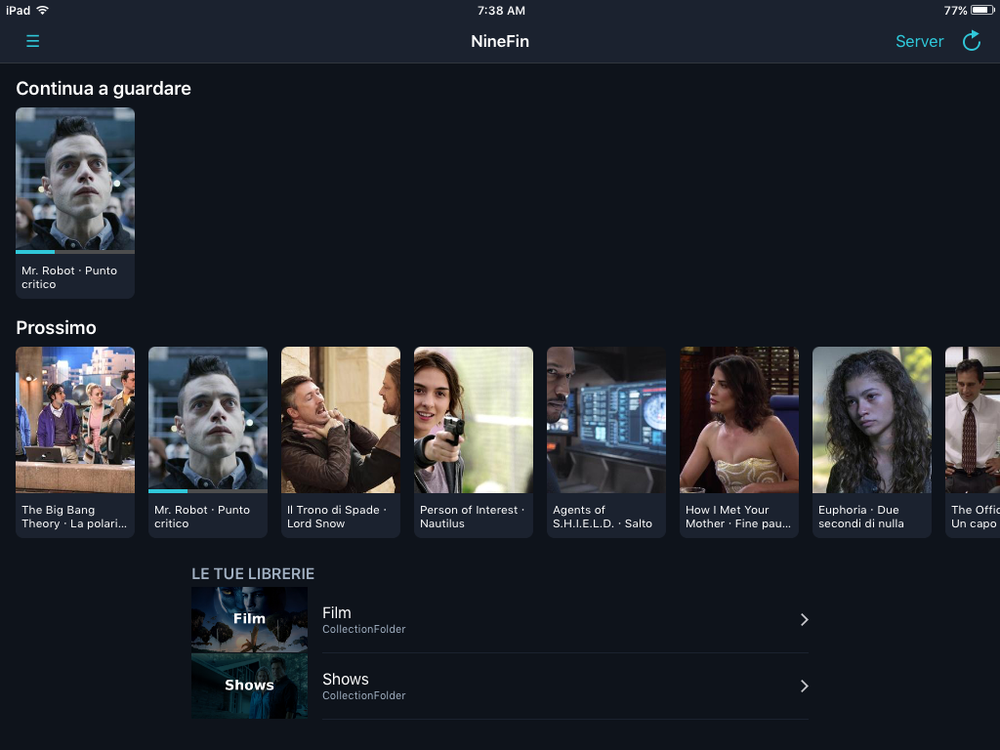
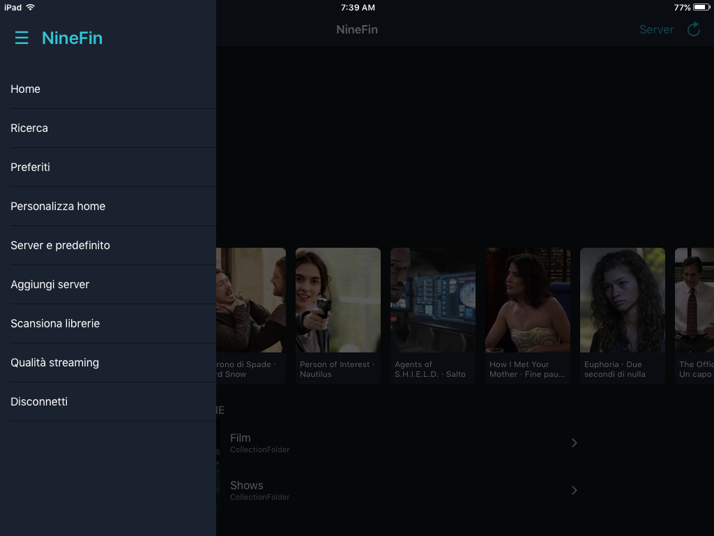
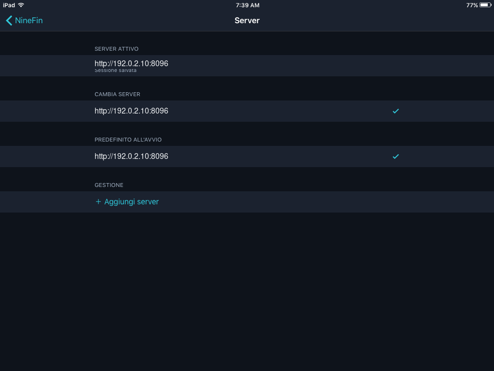
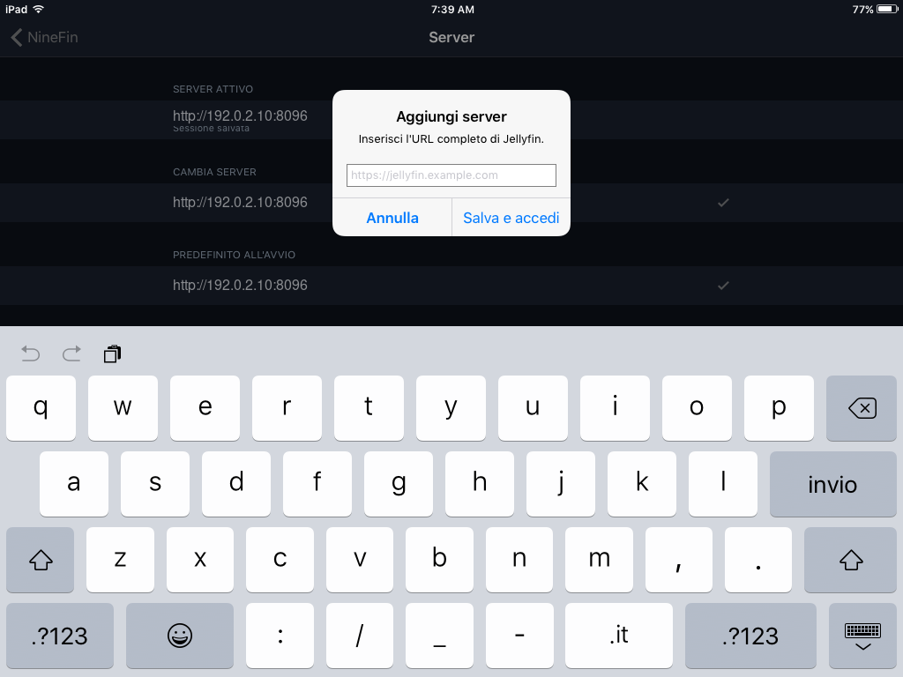

# NineFin — Jellyfin client for legacy iOS 9

**NineFin is a native Jellyfin client for legacy iPhone and iPad devices running iOS 9.**  
It is written in Objective-C with Theos and targets 32-bit ARMv7 devices such as the iPhone 4S and older iPads.

NineFin is designed for people who want to keep using Jellyfin on legacy iOS hardware without relying on a modern browser or a current App Store client.

## Download prebuilt IPA

Prebuilt IPA files are provided in the GitHub Releases section, so you do **not** need to compile NineFin yourself if you only want to install the app.

**Latest release:** https://github.com/LukeLeFox/NineFin/releases/latest

Current public release:

- NineFin 0.7.3
- Bundle ID: `dev.luke.ninefin`
- iOS 9.0+
- ARMv7
- Prebuilt IPA included in the release assets

NineFin 0.7.3 is the current offline playback and synchronization release. Its prebuilt IPA is available from the latest GitHub Release.

> On legacy iOS 9 hardware, installation requires a compatible IPA sideload method. A jailbroken device with AppSync Unified is the recommended setup used during NineFin testing.

## Screenshots

| Home and Continue Watching | Library navigation |
|---|---|
|  |  |
| Server management | Add-server dialog |
|  |  |

The screenshots use documentation-only network addresses and contain no private server details.

## Features

- Jellyfin server login with credentials and sessions stored in the iOS Keychain
- Multiple saved servers and a selectable default server
- Home sections for Continue Watching, Next Up, recent movies, and recent series
- Library browsing, discovery, global search, and favorites
- Native HLS playback with configurable streaming quality
- Playback progress synchronization with Jellyfin
- Correct playback-completion reporting and watched-state handling
- Downloads for offline playback, managed directly from an item's detail screen
- A dedicated Downloads library with active-transfer progress and local storage controls
- Offline resume and watched-state tracking, queued safely while the server is unavailable
- Explicit online synchronization with conflict handling for server progress and completed items
- Audio-track and subtitle selection
- iPhone and iPad icon assets for iOS 9

## Offline playback and synchronization

NineFin 0.7.3 adds a complete offline workflow for legacy devices:

- Download a movie or episode over an authenticated Jellyfin session
- Play downloaded media without a network connection
- Resume locally and mark playback as completed while offline
- Review or remove saved media from the **Downloads** screen
- Return online and synchronize queued progress with the same Jellyfin server and user account

When both the server and the offline device have newer playback information, NineFin resolves the state conservatively: completed items stay completed, server progress that is already ahead is preserved, and pending local progress is retained when it cannot be synchronized safely.

## Compatibility

NineFin is specifically intended as a **Jellyfin client for legacy iOS devices**.

- Deployment target: iOS 9.0
- Architecture: ARMv7 / 32-bit
- Toolchain SDK target: iOS 9.2
- Package format: IPA
- Tested on legacy iPhone/iPad hardware

The project intentionally keeps its legacy deployment settings in the `Makefile`. Changing the target SDK, deployment target, or architecture can break compatibility with the devices this app is intended to support.

## Build from source

Install [Theos](https://theos.dev/docs/installation) with an iOS 9.2 SDK, then run:

```sh
FINALPACKAGE=1 make package
```

The generated IPA is written to `packages/`. Build output, IPA files, local logs, and backup files are excluded from version control.

If you do not want to build from source, use the precompiled IPA from:

https://github.com/LukeLeFox/NineFin/releases/latest

## Search keywords

NineFin may also be useful to people searching for:

- Jellyfin iOS 9
- Jellyfin iPhone 4S
- Jellyfin legacy iOS client
- Jellyfin ARMv7
- Jellyfin old iPhone
- Jellyfin old iPad
- Jellyfin IPA
- Jellyfin client for jailbroken iOS

## Server security

NineFin permits arbitrary network loads so it can connect to legacy and local Jellyfin deployments. Prefer HTTPS whenever the server supports it, especially outside a trusted local network.

## Project website

A lightweight project page is included under `docs/` and can be published with GitHub Pages.

Expected GitHub Pages URL:

https://lukelefox.github.io/NineFin/

## Disclaimer

NineFin is an independent community project and is not affiliated with or endorsed by Jellyfin.

Jellyfin is a trademark of its respective owners.

## License

NineFin is available under the [MIT License](LICENSE).
